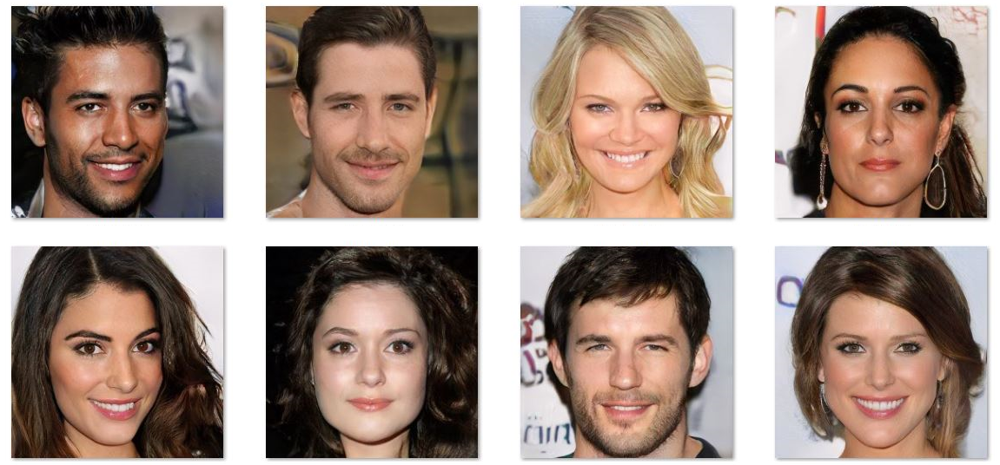
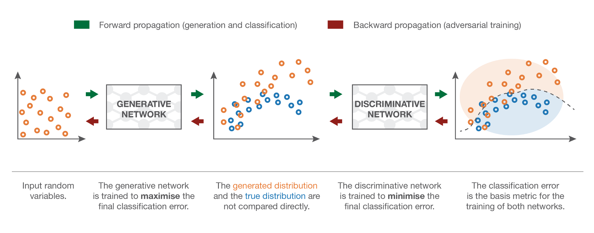
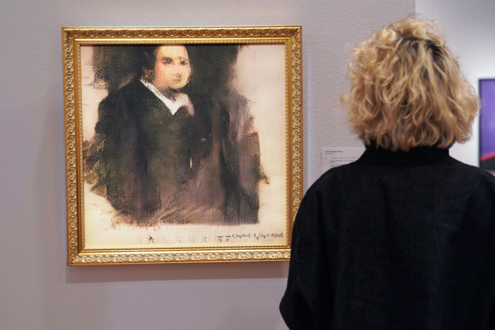
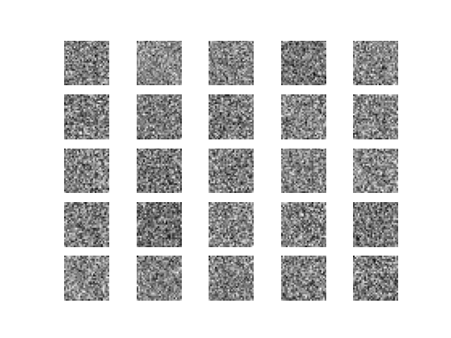
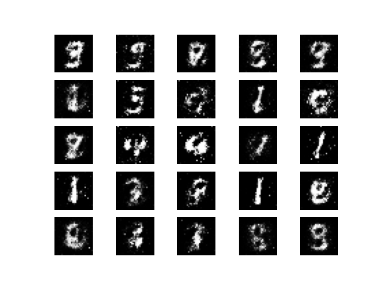
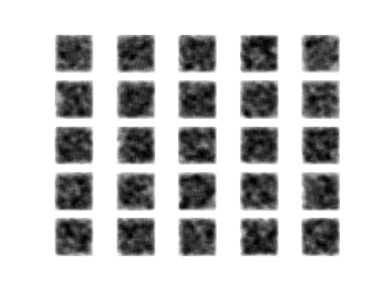

# Generative Adversarial Networks
## Short Reading
### Overview
Generative adversarial networks (GANs) are probably one of the most interesting architectures to have come out of machine learning. Instead of having neural networks that simply extract information out of data to infer patterns for generalization, two neural networks essentially battle (they're adversarial) each other ~for supremacy~ to generate/produce new data that are very believable.


<sub> All the above faces are fake and generated from a GAN. These people do not exist. </sub>

One of the two neural networks is the *generator*, which learns to create new data that resembles the original training data. Its goal is to become so convincing that the discriminator cannot tell its generated images apart from real ones — in other words, to fool the discriminator as often as possible.

The other network is the *discriminator*, which is fed both real training data and generator-produced fakes. Its goal is to correctly identify which images are real and which are not — getting as good as possible at spotting the generator's fakes.

The two networks are locked in an ongoing competition: the generator continuously improves to produce more convincing fakes, while the discriminator continuously sharpens its ability to detect them. This back-and-forth is what drives both networks to improve — the generator produces increasingly realistic outputs, and the discriminator develops an increasingly refined sense of what "real" data looks like.



### Example generations of GANs
As you have seen from the fake faces above, GANs have incredible capability to create very realistic fake data. As such, they have multiple applications most especially in ones that require the creation of something new, like art.

#### 1.

My first example is from "High-Resolution Image Synthesis and Semantic Manipulation with Conditional GANs." As you can see by (a), (b), and (c) below, none of these images are real but instead generated by a GAN. They're given shapes that represent labels similar to what you see in the bottom left corner of (a):
- Blue shapes that represent cars
- Pale purple shapes that represents the road
- Magenta shapes that represents the sidewalk
- Green shapes that represents trees
- etc.

And the GAN just "colors" these shapes into the labels that they represent like the prodigy 3-year-old toddler that it is.


You can find more information about this in [this paper](https://arxiv.org/pdf/1711.11585.pdf).

#### 2.

Second up: art that sold for $400,000. It looks terrible. Not going to explain it further, but it does pose an interesting question: can AI finally start replicating "creativity?"



You can find more information about this in [this article](https://www.vulture.com/2018/10/an-artificial-intelligence-artwork-just-sold-for-usd400-000.html).

#### 3.

In case you lost hope with neural networks being able to do super-resolution, GANs are currently the preferred method for generating super-resolution images. For your reference, bicubic resizing is the algorithm you'd normally find in typical image editors like GIMP or Adobe Photoshop. What you see here is 4x upscaling, and SRGAN is the proposed GAN method:


You can find more information about this in [this paper](https://arxiv.org/pdf/1609.04802.pdf).

### GAN Deeper Dive
If you'd like to know more about GANs in a deeper level, this is a good resource that is not incredibly difficult to read that walks you through the thought process of the inception of GANs.

https://towardsdatascience.com/understanding-generative-adversarial-networks-gans-cd6e4651a29

## GAN Tutorial

This is a simpler multi-layer perceptron based GAN. I've simplified the code a little bit and will be walking through it.

Here are the libraries that we are importing. As you can see, we're using MNIST. Not only that, but we're making a generative adversarial network based on multi-layer perceptrons using `nn.Linear` layers. We also add batch normalization through `nn.BatchNorm1d` and the `nn.LeakyReLU` activation.

```py
import torch
import torch.nn as nn
import torch.optim as optim
from torchvision import datasets, transforms
import numpy as np
import matplotlib.pyplot as plt
import os
```

First, let's build our generator. As we can see, the generator takes a noise vector of size 100 as input. The generator's job is to create ("model"/"carve") something meaningful out of this noise vector — essentially creating new data.

> **Note on BatchNorm momentum:** PyTorch's `nn.BatchNorm1d(momentum=m)` uses `m` as the weight given to the *new* batch statistics when updating the running mean and variance. A value of `0.2` means 20% of the update comes from the current batch.

```py
class Generator(nn.Module):
    def __init__(self):
        super().__init__()
        self.model = nn.Sequential(
            nn.Linear(100, 256),
            nn.LeakyReLU(0.2),
            nn.BatchNorm1d(256, momentum=0.2),
            nn.Linear(256, 512),
            nn.LeakyReLU(0.2),
            nn.BatchNorm1d(512, momentum=0.2),
            nn.Linear(512, 1024),
            nn.LeakyReLU(0.2),
            nn.BatchNorm1d(1024, momentum=0.2),
            nn.Linear(1024, 28 * 28),
            nn.Tanh(),
        )

    def forward(self, z):
        return self.model(z)    # output shape: (N, 784)
```

Next, we have our discriminator. It takes in a flattened image `(N, 784)` and outputs a single value between 0 and 1 using sigmoid — 1 for real, 0 for fake. In PyTorch we simply create a separate optimizer for the discriminator.

```py
class Discriminator(nn.Module):
    def __init__(self):
        super().__init__()
        self.model = nn.Sequential(
            nn.Linear(28 * 28, 512),
            nn.LeakyReLU(0.2),
            nn.Linear(512, 256),
            nn.LeakyReLU(0.2),
            nn.Linear(256, 1),
            nn.Sigmoid(),
        )

    def forward(self, img):
        return self.model(img)  # output shape: (N, 1)

device = torch.device('cuda' if torch.cuda.is_available() else 'cpu')
generator     = Generator().to(device)
discriminator = Discriminator().to(device)
print(discriminator)
```

Next, let's load the MNIST dataset. We are:
1. Loading only the training images (throwing away labels, as this is unsupervised).
2. Rescaling the data from -1 to 1, to match the `tanh` activation found in our generator.
3. Flattening the images to `(N, 784)` vectors so they can be fed into the MLP discriminator.
4. Defining ground truth labels: `1` for valid (real) images, and `0` for fake, generated images.

```py
# Load MNIST
train_data = datasets.MNIST(root='./data', train=True, download=True, transform=transforms.ToTensor())
X_train    = train_data.data.numpy().astype('float32')
X_train    = X_train / 127.5 - 1.          # rescale to [-1, 1]
X_train    = X_train.reshape(-1, 28 * 28)  # flatten to (N, 784)
X_tensor   = torch.tensor(X_train).to(device)

BATCH_SIZE = 16
valid = torch.ones(BATCH_SIZE,  1).to(device)   # real labels
fake  = torch.zeros(BATCH_SIZE, 1).to(device)   # fake labels
```

Now, we're going to create images through the generator. We feed it a *latent noise vector* — essentially random noise from a normal distribution. This is what allows the variability of the generated output. The generator must learn to map this meaningless noise into something that looks like an MNIST digit.

#### Controlling Which Weights Update

PyTorch gives you explicit, transparent control over which weights get updated during each training step. We use two techniques:

1. **`gen_imgs.detach()`** when training the discriminator: this stops gradients from flowing back into the generator during the discriminator update step.
2. **Separate optimizers**: `d_optimizer` only holds the discriminator's parameters, and `g_optimizer` only holds the generator's parameters. When we call `g_optimizer.step()`, only generator weights update — the discriminator is untouched, even though gradients did flow through it.

This means you always know exactly which weights are being updated at every step.

```py
criterion   = nn.BCELoss()
d_optimizer = optim.Adam(discriminator.parameters(), lr=0.0002, betas=(0.5, 0.999))
g_optimizer = optim.Adam(generator.parameters(),     lr=0.0002, betas=(0.5, 0.999))
```

Now we train the model. Here is the breakdown:
1. Randomly sample a batch of real images.
2. Create a latent noise vector (`noise = torch.randn(BATCH_SIZE, 100)`).
3. Get the generator to produce fake images from the noise vector.
4. Train the discriminator on real images (target: `1`) and fake images (target: `0`). Use `.detach()` on fake images so gradients do not flow into the generator.
5. Train the generator: pass new noise through the generator, then through the discriminator, and compute loss against `valid` (target: `1`) — because the generator *wants* the discriminator to think its output is real.
6. Print out the losses of each.

```py
for epoch in range(10000):
    # ── Sample real images ───────────────────────────────────────────────────
    idx  = np.random.randint(0, X_tensor.shape[0], BATCH_SIZE)
    imgs = X_tensor[idx]

    # ── Train Discriminator ──────────────────────────────────────────────────
    noise    = torch.randn(BATCH_SIZE, 100).to(device)
    gen_imgs = generator(noise).detach()   # detach: no grad flows into generator here

    d_optimizer.zero_grad()
    d_loss_real = criterion(discriminator(imgs),     valid)
    d_loss_fake = criterion(discriminator(gen_imgs), fake)
    d_loss      = (d_loss_real + d_loss_fake) / 2
    d_loss.backward()
    d_optimizer.step()

    # ── Train Generator ──────────────────────────────────────────────────────
    noise    = torch.randn(BATCH_SIZE, 100).to(device)
    gen_imgs = generator(noise)            # no detach: we want gradients to update generator

    g_optimizer.zero_grad()
    g_loss = criterion(discriminator(gen_imgs), valid)   # generator wants D to say "real"
    g_loss.backward()
    g_optimizer.step()

    d_acc = ((discriminator(imgs) > 0.5).float().mean().item() * 0.5 +
             (discriminator(generator(torch.randn(BATCH_SIZE, 100).to(device)).detach()) < 0.5).float().mean().item() * 0.5)

    comb_str = "Epoch {:.5s}: {:.40s} | {} ".format(
        f"{epoch}{' ' * 100}",
        f"Discriminator - Loss: {round(d_loss.item(),4)}, Acc: {round(d_acc,4)} {' ' * 100}",
        f"Generator - Loss: {round(g_loss.item(),4)}")
    print(comb_str)
```

This last piece of code is to generate and save some sample images as the model trains. The generated images look something like this:

|At epoch 0: | At epoch 9800: |
|---|---|
|| |

```py
    if epoch % 200 == 0:
        r, c = 5, 5
        noise    = torch.randn(r * c, 100).to(device)
        with torch.no_grad():
            gen_imgs = generator(noise).cpu().numpy()

        gen_imgs = 0.5 * gen_imgs + 0.5        # rescale from [-1,1] to [0,1]
        gen_imgs = gen_imgs.reshape(-1, 28, 28) # unflatten for display

        fig, axs = plt.subplots(r, c)
        cnt = 0
        for i in range(r):
            for j in range(c):
                axs[i, j].imshow(gen_imgs[cnt], cmap='gray')
                axs[i, j].axis('off')
                cnt += 1
        os.makedirs('imagesmlp', exist_ok=True)
        fig.savefig("imagesmlp/%d.png" % epoch)
        plt.close()
```

This code can actually be adapted to use a convolutional neural network that is similar to what we've seen in previous homeworks as a generator and discriminator instead of using a multi-layer perceptron. Here is what that output looks like; notice how the generated image is different between an untrained CNN vs. an untrained MLP thanks to the various convolutions and upsampling layers:

|At epoch 0: | At epoch 8200: |
|---|---|
|| |


Here would be your entire code:
```py
import torch
import torch.nn as nn
import torch.optim as optim
from torchvision import datasets, transforms
import numpy as np
import matplotlib.pyplot as plt
import os


class Generator(nn.Module):
    def __init__(self):
        super().__init__()
        self.model = nn.Sequential(
            nn.Linear(100, 256),
            nn.LeakyReLU(0.2),
            nn.BatchNorm1d(256, momentum=0.2),
            nn.Linear(256, 512),
            nn.LeakyReLU(0.2),
            nn.BatchNorm1d(512, momentum=0.2),
            nn.Linear(512, 1024),
            nn.LeakyReLU(0.2),
            nn.BatchNorm1d(1024, momentum=0.2),
            nn.Linear(1024, 28 * 28),
            nn.Tanh(),
        )

    def forward(self, z):
        return self.model(z)


class Discriminator(nn.Module):
    def __init__(self):
        super().__init__()
        self.model = nn.Sequential(
            nn.Linear(28 * 28, 512),
            nn.LeakyReLU(0.2),
            nn.Linear(512, 256),
            nn.LeakyReLU(0.2),
            nn.Linear(256, 1),
            nn.Sigmoid(),
        )

    def forward(self, img):
        return self.model(img)


device        = torch.device('cuda' if torch.cuda.is_available() else 'cpu')
generator     = Generator().to(device)
discriminator = Discriminator().to(device)
print(discriminator)

train_data = datasets.MNIST(root='./data', train=True, download=True, transform=transforms.ToTensor())
X_train    = train_data.data.numpy().astype('float32') / 127.5 - 1.
X_train    = X_train.reshape(-1, 28 * 28)
X_tensor   = torch.tensor(X_train).to(device)

BATCH_SIZE = 16
valid = torch.ones(BATCH_SIZE,  1).to(device)
fake  = torch.zeros(BATCH_SIZE, 1).to(device)

criterion   = nn.BCELoss()
d_optimizer = optim.Adam(discriminator.parameters(), lr=0.0002, betas=(0.5, 0.999))
g_optimizer = optim.Adam(generator.parameters(),     lr=0.0002, betas=(0.5, 0.999))

for epoch in range(10000):
    idx  = np.random.randint(0, X_tensor.shape[0], BATCH_SIZE)
    imgs = X_tensor[idx]

    noise    = torch.randn(BATCH_SIZE, 100).to(device)
    gen_imgs = generator(noise).detach()

    d_optimizer.zero_grad()
    d_loss = (criterion(discriminator(imgs), valid) + criterion(discriminator(gen_imgs), fake)) / 2
    d_loss.backward()
    d_optimizer.step()

    noise    = torch.randn(BATCH_SIZE, 100).to(device)
    gen_imgs = generator(noise)

    g_optimizer.zero_grad()
    g_loss = criterion(discriminator(gen_imgs), valid)
    g_loss.backward()
    g_optimizer.step()

    comb_str = "Epoch {:.5s}: {:.40s} | {} ".format(
        f"{epoch}{' ' * 100}",
        f"Discriminator - Loss: {round(d_loss.item(),4)} {' ' * 100}",
        f"Generator - Loss: {round(g_loss.item(),4)}")
    print(comb_str)

    if epoch % 200 == 0:
        r, c  = 5, 5
        noise = torch.randn(r * c, 100).to(device)
        with torch.no_grad():
            gen_imgs = generator(noise).cpu().numpy()
        gen_imgs = (0.5 * gen_imgs + 0.5).reshape(-1, 28, 28)
        fig, axs = plt.subplots(r, c)
        cnt = 0
        for i in range(r):
            for j in range(c):
                axs[i, j].imshow(gen_imgs[cnt], cmap='gray')
                axs[i, j].axis('off')
                cnt += 1
        os.makedirs('imagesmlp', exist_ok=True)
        fig.savefig("imagesmlp/%d.png" % epoch)
        plt.close()
```
