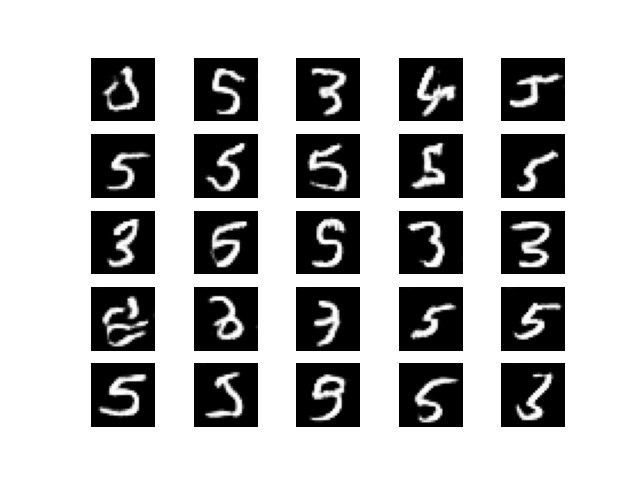

#  Assignment 5 Instructions

In this assignment, you'll be adapting the code found within the tutorial and changing the generator and discriminator to use a CNN architecture instead of MLP. Everything else - including dataset and data pre-processing remain the same. As this is a bonus opportunity, this assignment is a lot more difficult than the others.

## Hint 1.
My generator had the following first few layers. In PyTorch, `Reshape` is done inside `forward()` using `.view()`, and upsampling is done with `nn.Upsample(scale_factor=2)`:
```py
self.fc   = nn.Linear(100, 128 * 7 * 7)
self.relu = nn.ReLU()
# Then in forward():
#   x = self.relu(self.fc(z))
#   x = x.view(-1, 128, 7, 7)   # PyTorch uses channels-first format: (N, C, H, W)
#   x = nn.Upsample(scale_factor=2)(x)
```

## Hint 2.
My discriminator had the following first layer. Note that PyTorch Conv2d uses channels-first format `(N, C, H, W)`, so the input shape is `(N, 1, 28, 28)`:
```py
self.conv1 = nn.Conv2d(1, 32, kernel_size=3)   # input: (N, 1, 28, 28) — 1 channel, 28x28 image
# Then in forward(): x = torch.relu(self.conv1(x))
```

# Grading rubric
**Out of 100 points**

- 50 points: Have the neural network train.
- 50 points: Have the neural network generate something better than the results found within the MLP GAN in the instructions. It should look something similar (or better) than this baseline:

